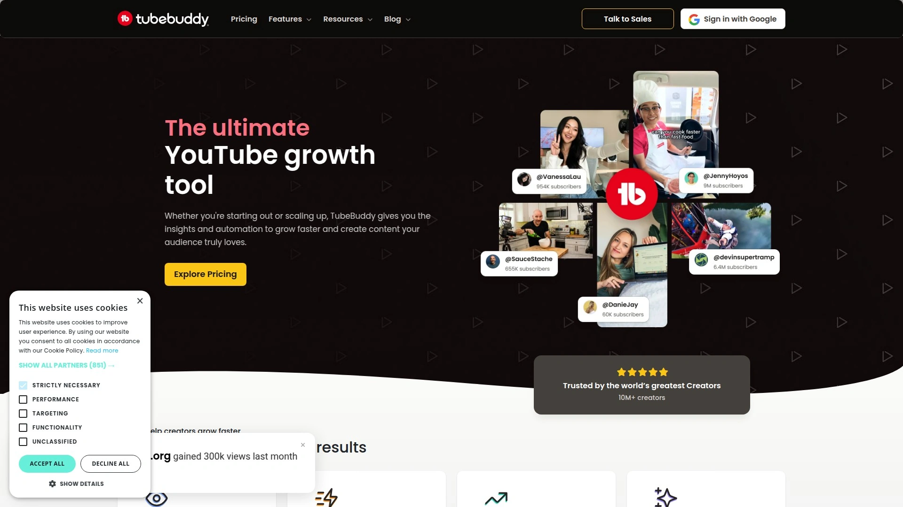
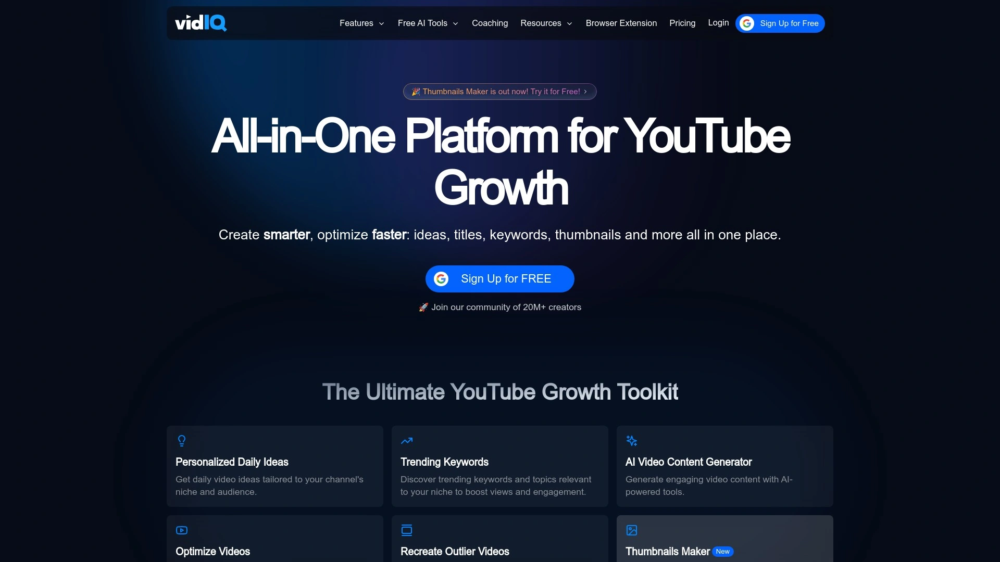
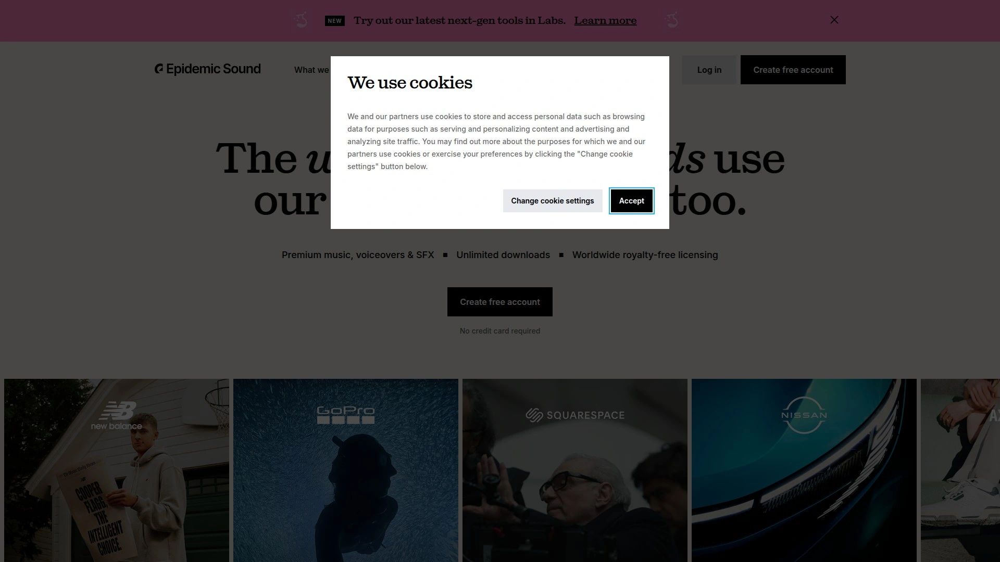
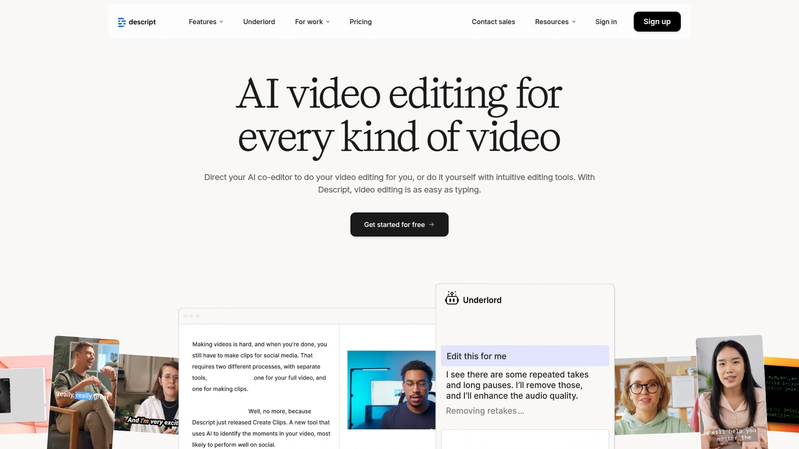
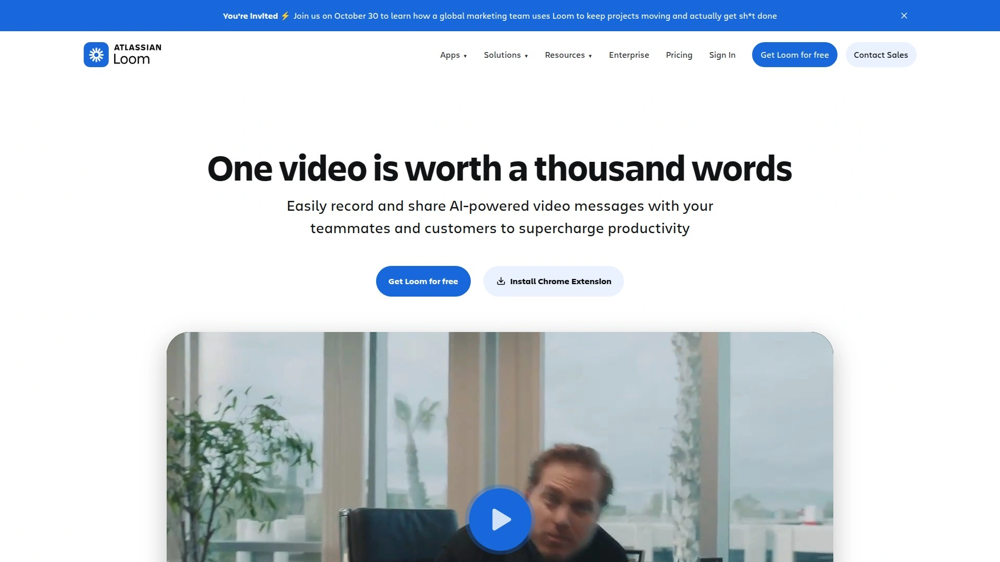
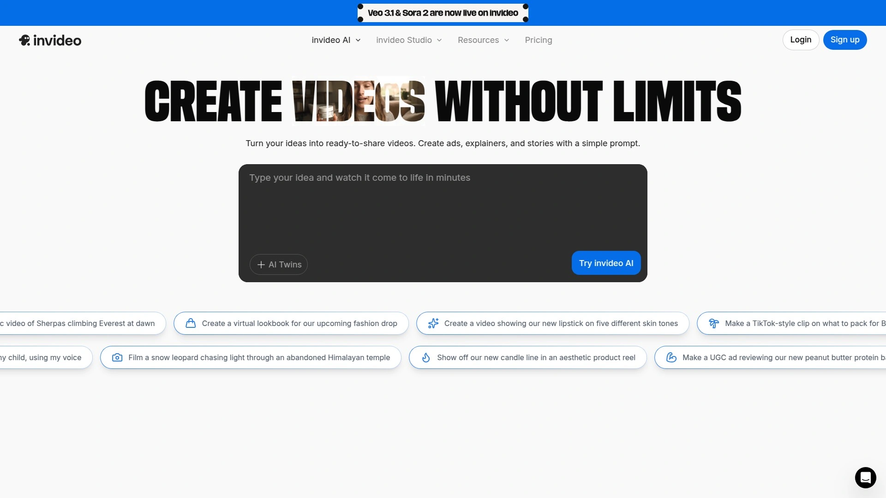
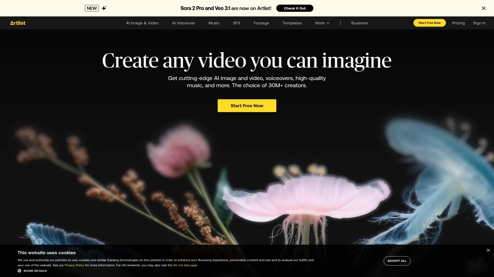
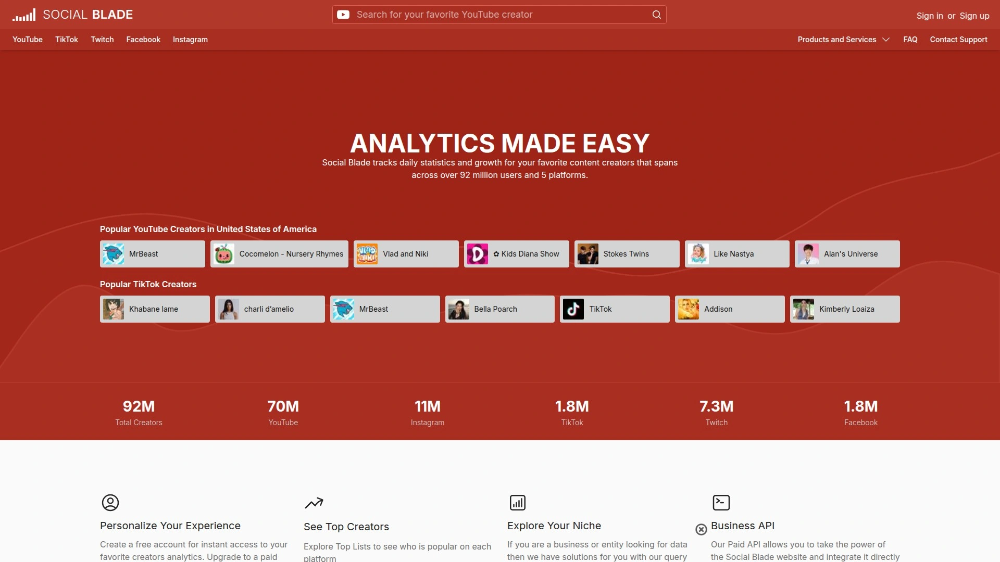
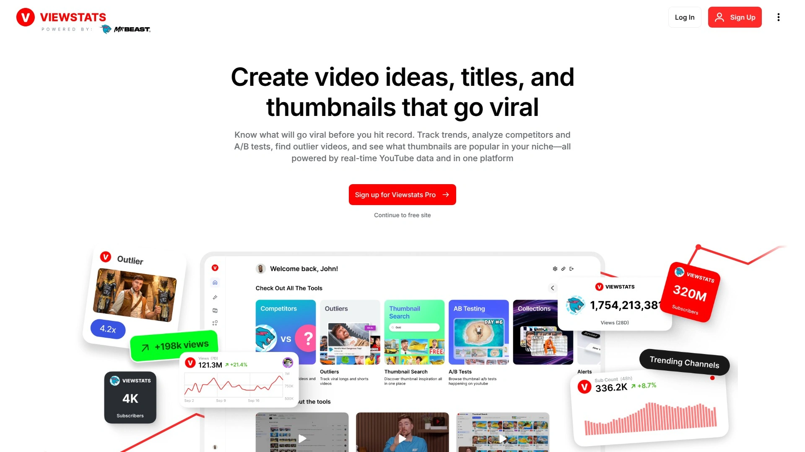

# Top 12 Best YouTube Channel Growth Tools in 2025 (In-Depth Review)

So you're grinding away, uploading videos weekly, obsessively checking subscriber counts at 3am, and wondering why the algorithm gods haven't blessed your channel yet. The truth? Luck helps, but data wins. The channels that blow up aren't just creating—they're optimizing every frame, every keyword, every upload time with precision tools that do the heavy lifting.

Whether you're stuck at 500 subscribers or managing a six-figure channel, the right YouTube growth software slices hours off research, spots viral opportunities you'd never see manually, and turns guesswork into strategy. This list walks you through twelve platforms that handle everything from keyword hunting to thumbnail split-testing to royalty-free music sourcing—so you can stop stressing and start scaling.

***

## **[TubeBuddy](https://tubebuddy.com)**

Browser extension built exclusively for YouTube creators needing SEO, keyword research, and bulk editing without leaving YouTube Studio.

TubeBuddy lives inside your workflow. Install the extension and suddenly YouTube Studio has superpowers: keyword scores that predict rankability, competitor tag copying, A/B thumbnail testing, bulk card additions across 50 videos at once, and search rank tracking so you know exactly where your videos land for target terms. The tool shines for anyone serious about YouTube SEO—whether you're researching "how to" niches or tracking which tags competitors use to rank. Pricing starts free with basic features; paid tiers unlock advanced tools like suggested video promotions and opportunity finder.

**What makes it stand out:** Real-time keyword scoring, video tag intelligence, retention graph analysis, and seamless YouTube Studio integration. No need to toggle between apps—TubeBuddy operates right where you're already working.

**Pricing tiers:** Free (limited features), Pro ($9/month), Legend ($19/month) with full SEO suite and advanced analytics.

**Best for:** Creators who live in YouTube Studio and want keyword research, competitor insights, and bulk management without the learning curve.

***

## **[VidIQ](https://vidiq.com)**

AI-powered YouTube analytics and optimization platform for creators chasing visibility through smarter SEO and real-time trend alerts.

VidIQ delivers keyword suggestions, competitor tracking, daily video ideas powered by AI, and a proprietary "VidIQ Score" that grades every video's viral potential based on SEO strength, engagement velocity, and related video placement. The Chrome extension overlays stats on any YouTube video you watch, letting you reverse-engineer successful channels. Paid plans include trend alerts (so you catch hot topics early), bulk description updates, and advanced analytics dashboards. VidIQ's AI coach even generates title variations and thumbnail concepts based on trending patterns.

**Core strengths:** Trend-based content recommendations, real-time keyword volume data, competitor video tracking, and AI-generated titles/descriptions.

**Pricing:** Free plan available; Boost plan ($39/month for full AI tools and unlimited keyword research).

**Ideal users:** Data-driven creators who want to ride trends early, analyze competitors deeply, and automate content ideation.

***

## **[Canva](https://www.canva.com)**

Drag-and-drop design platform for creating scroll-stopping YouTube thumbnails, channel art, and video graphics—no design degree required.

Canva makes visual content stupid simple. Choose from thousands of YouTube thumbnail templates optimized for 1280x720px, swap images, tweak fonts, apply filters, add shapes or stickers, and export in seconds. The AI thumbnail generator can create concepts from text prompts, and the Brand Kit (paid feature) locks in your fonts and colors for consistent branding. Canva also handles end screens, channel banners, intro slides, and social media graphics—all in one browser-based editor. Free version works great for basics; Pro unlocks premium stock photos, background remover, and custom fonts.

**Key features:** Pre-sized YouTube templates, AI-powered design suggestions, Brand Kit for consistency, one-click background removal (Pro), drag-and-drop simplicity.

**Pricing:** Free with watermark-free exports; Pro ($15/month) adds premium assets and advanced tools.

**Perfect for:** Creators who need professional-looking thumbnails and graphics fast, without learning Photoshop or hiring designers.

***

## **[Hootsuite](https://www.hootsuite.com)**

All-in-one social media scheduler that now supports YouTube video uploads, analytics, and cross-platform content calendars for streamlined publishing.

Hootsuite lets you schedule YouTube videos alongside Instagram, TikTok, Twitter, and LinkedIn posts from one dashboard. Upload your video, write title/description/tags, set visibility, and schedule for optimal posting times (Hootsuite suggests best times based on audience activity). You can monitor YouTube comments via Hootsuite Streams, approve/delete/reply in bulk, and track keywords across YouTube to spot emerging trends. The built-in OwlyWriter AI generates video descriptions and title ideas. Analytics show subscriber growth, watch time, and engagement—all compared across social platforms.

**Standout capabilities:** Multi-platform scheduling (YouTube + 6 other networks), comment moderation streams, AI content writer, suggested posting times, unified analytics.

**Pricing:** Free 30-day trial; plans start $99/month for 1 user and 10 social accounts.

**Best fit:** Social media managers juggling multiple platforms who want YouTube scheduling and analytics in the same tool they use for Instagram and Facebook.

***

## **[Epidemic Sound](https://www.epidemicsound.com)**

Royalty-free music library with 50,000+ tracks and 200,000 sound effects, designed to keep YouTube creators safe from copyright strikes and demonetization.

Epidemic Sound owns all rights to its catalog, meaning no copyright claims, no Content ID matches, and lifetime clearance for videos uploaded during your active subscription. Browse by mood, genre, tempo, or instrument; download full tracks or individual stems (vocals, drums, bass) for custom remixes. The platform integrates directly with your YouTube channel via Clearlist, so YouTube's Content ID system recognizes your licensed music automatically. Used by 70% of top 300 US YouTube channels. Tracks cover every style from cinematic orchestral to lo-fi beats to EDM.

**Why creators love it:** True royalty-free licensing, stem downloads for flexible editing, automatic YouTube clearance, massive high-quality catalog, no per-track fees.

**Pricing:** Personal plan starts $15/month; Commercial plan for client work starts $49/month.

**Ideal for:** YouTubers tired of muted videos, copyright claims, and limited music options—especially those monetizing content or working with brands.

***

## **[Descript](https://www.descript.com)**

Text-based video and podcast editor with AI transcription, filler word removal, and multitrack editing—perfect for creators who hate traditional timelines.

Descript transcribes your video automatically, then lets you edit by deleting text (the video cuts to match). Remove "ums" and long pauses with one click. Record remotely with up to 10 guests in 4K quality. The AI generates highlight clips for social media, removes background noise, and even creates overdub voiceovers (clone your own voice to fix mistakes without re-recording). Export to YouTube, TikTok, Instagram, or LinkedIn with auto-captions. Multitrack sequences let you edit speakers individually. The workflow feels more like Google Docs than Premiere Pro.

**Major strengths:** Text-based editing (edit video by editing transcript), AI filler word removal, remote recording with 10 guests, automatic highlight reel generation, voice cloning.

**Pricing:** Free plan (unlimited projects, limited transcription hours); Creator plan $24/month for 30 transcription hours and AI features.

**Best suited for:** Podcasters, interview-based creators, and anyone who wants fast, AI-assisted editing without mastering traditional video software.

***

## **[Loom](https://www.loom.com)**

Asynchronous video messaging tool for screen recording, webcam capture, and instant shareable links—ideal for tutorials, feedback, and team collaboration.

Loom records your screen, camera, or both simultaneously, then generates a shareable link instantly (no download wait). Perfect for quick explainer videos, walkthroughs, bug reports, or client updates. AI adds automatic titles, summaries, and chapters to every recording. Viewers leave timestamped comments and emoji reactions. Loom integrates with Slack, Gmail, Jira, Confluence, and Notion, so you can embed videos anywhere. Basic editing tools let you trim clips, add CTAs, and remove background noise. Mobile apps support iOS and Android recording on the go.

**What sets it apart:** Instant link sharing (no uploads), AI-generated titles and summaries, timestamped feedback, seamless team integrations, mobile and desktop recording.

**Pricing:** Free plan (up to 25 videos, 5-minute max); Business plan $15/user/month for unlimited videos and advanced AI features.

**Perfect for:** Creators making tutorial content, educators, and teams needing quick async video communication without formal editing.

***

## **[InVideo AI](https://invideo.io)**

AI video generator that creates full videos from text prompts—complete with script, stock footage, voiceovers, captions, and music in 50+ languages.

Type a prompt like "5-minute explainer about solar panels for homeowners" and InVideo AI writes the script, sources stock footage, adds voiceovers (with accent options), generates captions, and syncs background music. You can clone your own voice, create AI avatars for faceless videos, or generate UGC-style testimonials with virtual actors. Edit via text commands ("make intro shorter," "swap music genre to lo-fi"). Export in any aspect ratio (16:9, 9:16, 1:1) for YouTube, TikTok, or Instagram. The tool even translates and dubs videos into 50+ languages automatically.

**Core capabilities:** Full AI video generation from prompts, voice cloning, AI avatars, multilingual dubbing, text-based editing, stock footage licensing included.

**Pricing:** Free plan with watermark; Plus plan $25/month for HD exports and 50 minutes of AI generation.

**Ideal for:** Creators needing rapid video production at scale, faceless YouTube channels, or multilingual content without shooting or editing manually.

***

## **[Artlist](https://artlist.io)**

Pro-tier music and stock footage licensing platform offering unlimited downloads, lifetime project clearance, and sound effects for video creators.

Artlist provides high-quality music tracks, sound effects, stock footage, video templates, and AI-generated content—all cleared for commercial use. Download as much as you want; every asset licensed during your subscription stays cleared forever, even after canceling. The Pro license covers client work, TV, films, websites, podcasts, and all social platforms. Curated playlists organized by mood, genre, and use case make finding the right track fast. The platform also integrates with Premiere Pro, Final Cut, and DaVinci Resolve for seamless workflow.

**Key advantages:** Unlimited downloads, lifetime clearance, covers client/commercial projects, includes footage and templates, AI content creation tools.

**Pricing:** Social plan $14.99/month (personal use, single YouTube channel); Pro plan $29.99/month (client work, unlimited channels).

**Best for:** Professional creators, agencies, and filmmakers needing royalty-free music, footage, and SFX with worry-free licensing for paid projects.

***

## **[Social Blade](https://socialblade.com)**

Free channel statistics tracker showing real-time subscriber counts, estimated earnings, growth projections, and competitive rankings across YouTube and other platforms.

Social Blade displays live subscriber counts, daily/monthly view stats, estimated revenue ranges, and future growth predictions based on historical data. Compare any channel side-by-side to benchmark performance. The platform assigns letter grades (A through F) based on overall channel health. Track top channels globally by subscribers, views, or growth rate. Social Blade also covers Twitch, Instagram, Twitter, and TikTok. While earnings estimates are broad ranges, the tool excels at spotting growth trends and identifying channels worth studying.

**Standout features:** Real-time subscriber tracking, future growth forecasts, channel-to-channel comparison, platform rankings, estimated revenue calculator, free access.

**Pricing:** Completely free; premium features available via paid tiers (not required for basic tracking).

**Perfect for:** Creators monitoring their own growth, researching competitors, or tracking influencer channels for collaboration opportunities.

***

## **[ViewStats](https://www.viewstats.com)**

MrBeast-backed analytics platform tracking title/thumbnail changes, outlier video detection, and competitive intelligence for YouTube optimization.

ViewStats (created by MrBeast's team) tracks every title and thumbnail change on any YouTube video, showing how tweaks affect performance. The Outlier tool identifies videos that massively overperform or underperform compared to a channel's average, revealing what content resonates. Search for thumbnails by URL, set alerts for new uploads from tracked channels, and run A/B tests on titles and thumbnails. The platform provides detailed channel analytics including views, subscribers, estimated revenue, and growth velocity. Pro version unlocks alerts, competitor collections, and advanced analytics.

**What makes it unique:** Tracks title/thumbnail iterations, identifies outlier content, thumbnail reverse search, MrBeast's optimization methods baked in, competitor monitoring.

**Pricing:** Basic stats free; Pro version $10/month for alerts and advanced tracking.

**Ideal for:** Growth-focused creators obsessed with optimization, anyone studying viral content patterns, and channels testing titles/thumbnails aggressively.

***

## **[YouTube Studio](https://studio.youtube.com)**

YouTube's native creator dashboard offering free analytics, video management, comment moderation, and monetization tracking—directly from Google.

YouTube Studio is home base for every creator. Check real-time analytics (views, watch time, subscriber changes), track traffic sources (search, suggested videos, external), analyze audience retention graphs, moderate comments, respond to viewers, manage playlists, upload videos, edit metadata, and monitor revenue. The Inspiration tab suggests trending topics and content gaps based on your audience's viewing habits. Ask Studio (AI-powered assistant) answers questions like "why did my last video underperform?" or "what's my audience saying about my editing style?" Free for all creators.

**Core tools:** Comprehensive analytics dashboard, audience retention breakdowns, traffic source tracking, comment moderation, monetization reports, AI-powered content suggestions.

**Pricing:** Free for all YouTube creators.

**Best suited for:** Every YouTuber—it's the foundation. Use third-party tools to enhance Studio's data, not replace it.

***

## FAQ

**How do I pick the right YouTube growth tool for my channel size?**

Start with free tools like TubeBuddy or VidIQ for keyword research and basic analytics. Once you're consistently uploading and need deeper competitor insights or bulk editing, upgrade to paid tiers. Smaller channels benefit most from SEO tools; larger channels gain more from advanced analytics and automation.

**Can these tools actually help me rank higher in YouTube search?**

Yes, if you use them correctly. Tools like TubeBuddy and VidIQ provide keyword scores, search volume data, and competition analysis—helping you target terms you can actually rank for. But tools don't replace quality content; they just make your optimization smarter and faster.

**Do I need multiple tools, or will one cover everything?**

Most creators combine 2-3 tools. For example: TubeBuddy for SEO + Canva for thumbnails + Epidemic Sound for music. No single platform does everything perfectly, so stack tools that complement your workflow without overlapping features.

***

## Conclusion

Growing a YouTube channel isn't magic—it's strategy, repetition, and using the right tools to cut through the noise. Whether you're optimizing keywords, split-testing thumbnails, or sourcing copyright-safe music, the platforms above handle the tedious stuff so you can focus on creating. For creators who want the most bang for their buck, [TubeBuddy](https://tubebuddy.com) covers keyword research, SEO optimization, and bulk management right inside YouTube Studio—making it the smartest first investment for channels serious about growth. Click in, test the free version, and watch how fast data beats guesswork.
